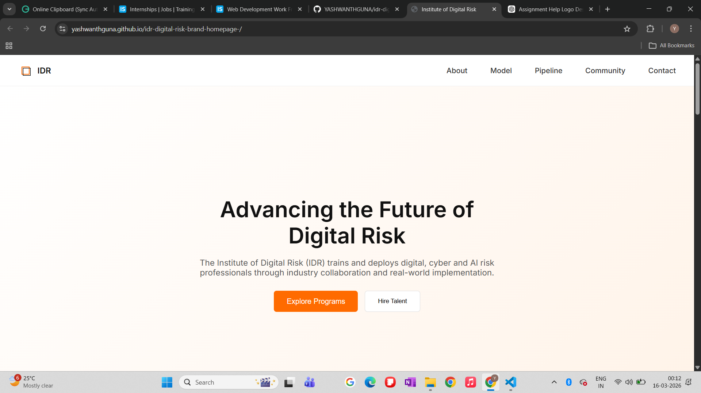
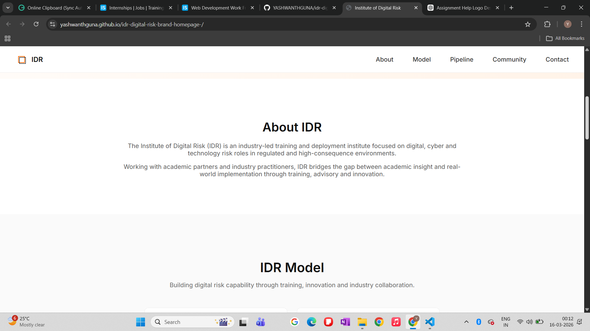
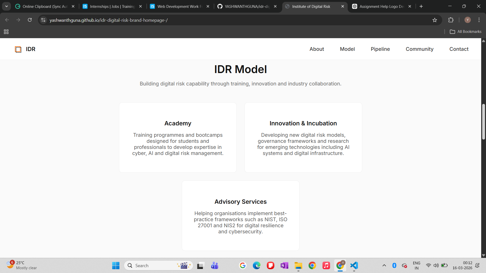
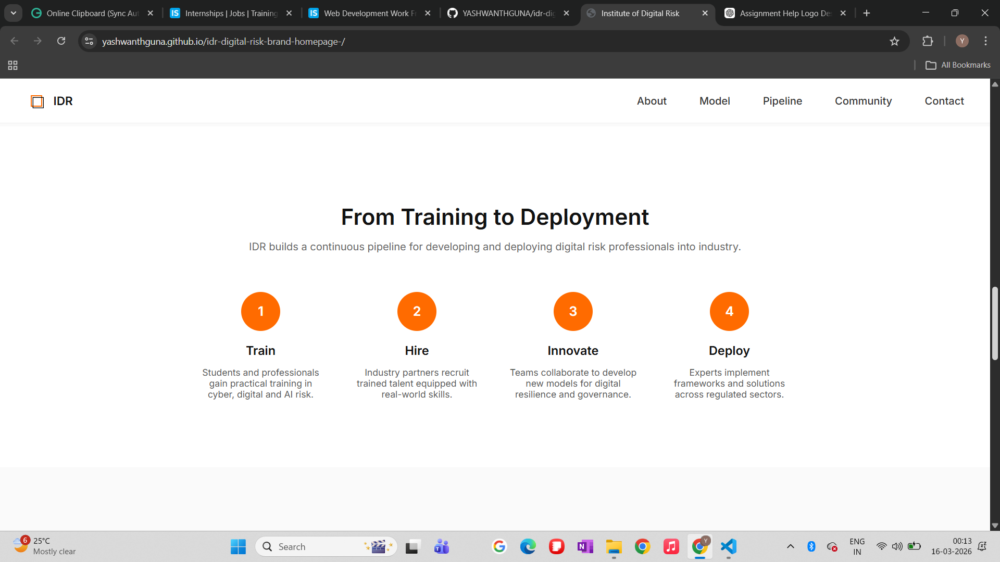
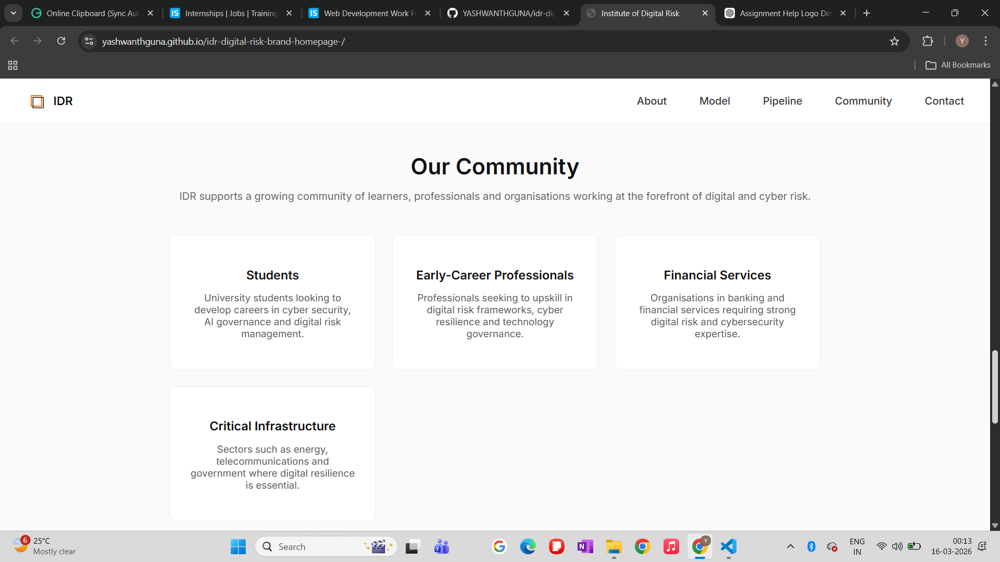
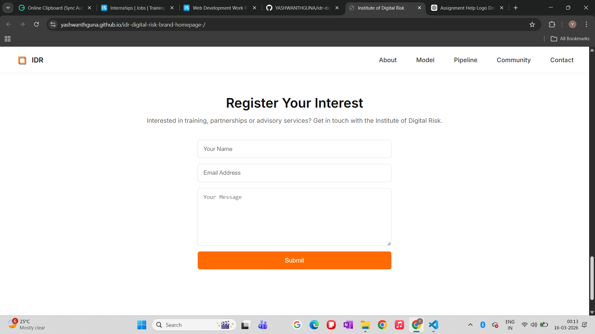

# Institute of Digital Risk – Brand & Homepage

This project is a branding and homepage design assignment for the **Institute of Digital Risk (IDR)**.

The goal of the assignment was to design a simple brand identity and develop a responsive single-page website explaining the institute’s mission, services, and community.

---

## Live Website

View the deployed project here:

https://yashwanthguna.github.io/idr-digital-risk-brand-homepage-/

---

## Project Features

- Minimalist **cube-inspired logo design**
- Responsive **single page website**
- Sticky navigation bar with **smooth scrolling**
- Modern hero section with clear call-to-action
- Structured content sections
- Clean and accessible UI
- Mobile-friendly layout

---

## Sections Implemented

The website includes the following sections:

### Hero Section
Introduces the institute's mission and provides primary call-to-action buttons.

### About IDR
Explains the purpose of the Institute of Digital Risk and its connection to academic research and industry practice.

### IDR Model
Three core pillars of the institute:

- Academy  
- Innovation & Incubation  
- Advisory Services  

### Pipeline
Visual representation of the development pipeline:

Train → Hire → Innovate → Deploy

### Community
Describes the key groups served by IDR:

- Students
- Early-Career Professionals
- Financial Services
- Critical Infrastructure

### Contact / Register Interest
Simple contact form allowing visitors to express interest in training, partnerships, or advisory services.

---

## Technologies Used

- HTML5 (Semantic Structure)
- CSS3 (Flexbox & Grid)
- Vanilla JavaScript
- Google Fonts

No CSS frameworks were used as per assignment requirements.

---

## Project Structure

```
idr-digital-risk-brand-homepage
│
├── assets
│   ├── idr-icon.svg
│   └── idr-logo.svg
│
├── screenshots
│
├── index.html
├── style.css
├── script.js
└── design-notes.txt
```

---

## Screenshots

### Hero Section


### About Section


### Model Section


### Pipeline Section


### Community Section


### Contact Section


---

## Logo Design

The logo uses a **cube-inspired geometric shape** representing structured systems, resilience and digital risk frameworks.

The colour palette of **orange, black and white** reflects innovation, authority and clarity while maintaining a minimalist technology-focused aesthetic.

---

## Author

Yashwanth Guna
